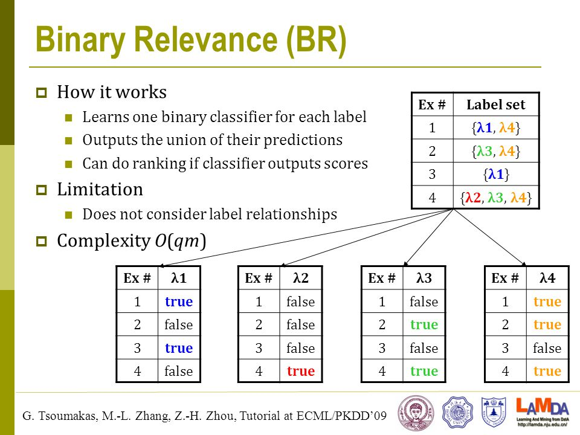
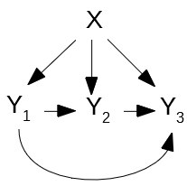

# TOXIC COMMENT PROJECT
# ABOUT DATASET

In this repository, I'm working on a Toxic comment classification project - It's a multi-label classification (It basically means, each comment can belong to more than one category)  For example, an article can belong to deep learning and NLP..

In this dataset, We are provided with a large number of Wikipedia comments which have been labeled by human raters for toxic behavior.

The types of toxicity are: 

<strong>toxic, severe toxic, obscene, threat, insult, identity hate.</strong>

# PROBLEM 
It is a multi-label classification problem, in this context it means that the text belongs to one or more labels.
Ex : A text could belong to toxic and insult labels.

# IMPLEMENTATION 
In this repository, I'm classifying the labels using Scikit-Multilearn library

1] Data pre-processing :

First, Used NLTK library for stopwords and stemmer and did some basic processing like removing --> HTML tags, punctuation, common and rare words.

<strong> STEMMER </strong>
  
Stemming is a simpler version  where we are interested in stripping the suffix at the end of the word. When stemming we are interesting in reducing the inflected or derived word to it's base form.

inflections: adding a suffix to a word, that doesn't change its grammatical category, such as tenses in verbs (-ing, -ed, -s), plural in nouns (s).

derivations - adding a suffix to a word, that changes its grammatical category, such as nation (noun) => national (adjective) => nationalize (verb).

<strong> VECTORIZER </strong>
Used TF-IDf and CountVectorizer

<strong> Scikit-Multilearn </strong>
#### Binary Relevance

What is Binary Relevance ?

the data is split up into L data sets, where L is the number of labels. Each subset has a column where either a 0 or a 1 is assigned to an instance, indicating the presence or absence of that label on that instance. A separate classifier is trained on each data set.
I used GaussianNB and Logistic Regression as a separate classifier to train on each dataset.

#### Classifier Chain

What is Classifier Chain ?

Classifier chains are akin to binary relevance, however the target variables (y1, y2,.., yn) are not fully independent. The features (x1, x2,.., xm) are initially used to predict y1. Next (x1, x2,.., xm, y1) is used to predict y2. At the nth step, (x1, x2,.., xm, y1,.., yn−1) predicts yn. The ordering in which the labels are predicted can be determined by the user and can greatly influence the results.

#### LOSS
Hamming loss ?

In simple terms, Hamming loss calculates the incorrectly classified labels, it uses XOR bettween the actual and predicted labels. 

Whereas, Accuracy score calculates the correctly classified labels.

# THE OTHER NOTEBOOK IN WHICH I TOOK LSTM APPROACH.
# TOKENIZER - Breaking your pieces of text into individual words.

Ref : https://machinelearningmastery.com/prepare-text-data-deep-learning-keras/

Used keras tokenizer, 

from keras.preprocessing.text import Tokenizer
docs = ['Hey yo', 
        'Bye yo', 
        'how are you', 
        'what are you doing']
        
t = Tokenizer()

t.fit_on_texts(docs)

print(t.word_counts)

print(t.document_count)

print(t.word_index)

print(t.word_docs)

Output : 
OrderedDict([('hey', 1), ('yo', 2), ('bye', 1), ('how', 1), ('are', 2), ('you', 2), ('what', 1), ('doing', 1)])

4

{'yo': 1, 'are': 2, 'you': 3, 'hey': 4, 'bye': 5, 'how': 6, 'what': 7, 'doing': 8}

defaultdict(<class 'int'>, {'yo': 2, 'hey': 1, 'bye': 1, 'are': 2, 'how': 1, 'you': 2, 'what': 1, 'doing': 1})

<strong>
Once fit, the Tokenizer provides 4 attributes that you can use to query what has been learned about your documents:

word_counts: A dictionary of words and their counts.

word_docs: A dictionary of words and how many documents each appeared in.

word_index: A dictionary of words and their uniquely assigned integers.

document_count:An integer count of the total number of documents that were used to fit the Tokenizer.
</strong>

# MODEL 
We start with an input layer <strong>(keras.layers.Input)</strong> which takes shape of maxlen(which was = 200 (mximum length of all sequences)).

Model will have one input layer, 

one embedding layer, 

one LSTM layer with 128 neurons and one output layer with 6 neurons since we have 6 labels in the output.

Early Stopping: This callback ensures that we avoid overfitting by stopping training when the training and validation loss diverge.

# LOSS AND OPTIMIZER

model.compile(loss = 'binary_crossentropy', optimizer = 'adam', metrics = ['acc'])

# GRAPHS FOR LOSS AND ACCURACY

https://app.wandb.ai/pratikraut_/NLPProject?workspace=user-pratikraut_
